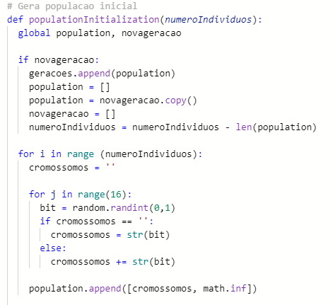
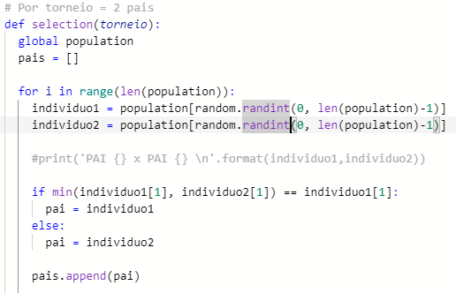
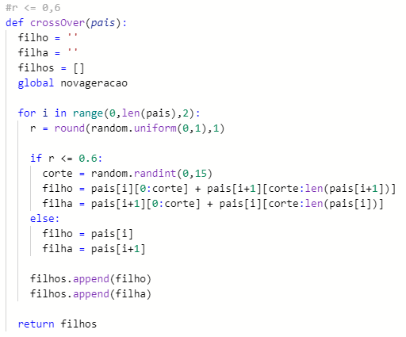
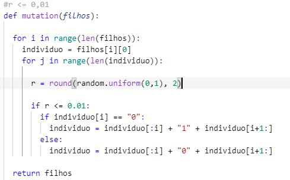
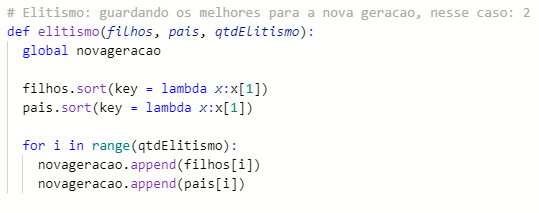

# Inteligência Artificial - Trabalho 02 2020/2 EAD
### Alunos: Caicke Pinheiro e Eduarda Simões<BR><BR>

## Como executar
O código foi desenvolvido em **Python** e para executá-lo, navegue até o diretório em que o arquivo `.py` se encontra e execute o arquivo.

```
python3 a-genetico.py
```
<BR>
## Definições
Alguns critérios foram definidos conforme orientação do trabalho, sendo respectivamente:<br>
<ul>
    <li>numero de individuos na populacao = 10;</li>
    <li>minimo de X = -20;</li>
    <li>maximo de X = 20;</li>
    <li>torneio = 2;</li>
    <li>geracoes = 10 e 20;</li>
	<li>cromossomos por individuo = 16 bits</li>
</ul><br>
E, a partir disso, outros foram definidos pelo grupo, são eles:<br>
<ul>
    <li>numero de elitismo = 2;</li>
    <li>numero de descendentes (crossover) na nova geracao = 2;</li>
</ul>
<BR>

## Explicação teórica

O **algoritmo genético** é uma técnica de busca utilizada na ciência da computação para achar soluções aproximadas em problemas de otimização e busca.

<br>

<figure style="text-align:center">
	
<i>Imagem retirada em <a href="www.electricalelibrary.com">www.electricalelibrary.com</a></i>
</figure>

<br>
<br>

O  que torna o algoritmo genético diferente de outros algoritmos tradicionais de otimização é que se baseia num conjunto de soluções possíveis, usando transações probabilísticas e seus resultados não são apresentados como solução única. A função-objetivo é o objeto da otimização, que nesse caso é dada como '<i><b>f(n)</b> = cos(X) * x + 2</i>'.  
<br>

## Implementação
Para a implementação do algoritmo, seguimos os seguintes passos:
<ul>
	<li>Iniciamos a população, com cada indivíduo sendo uma cadeia de bits aleatórios;</li>
	<li>Calculamos a aptidão de cada indíviduo, usando a função <i>fitness</i>;</li>
	<li>Selecionamos indívduos para o torneio, a fim de escolher os melhores pais</li>
	<li>Realizamos o crossover entre os pais, para gerar filhos com as cadeias de bits combinadas</li>
	<li>Realizamos o crossover entre os pais, para gerar filhos com as cadeias de bits combinadas</li>
	<li>Depois de obter a nova geração, realizamos mutação entre os indivíduos, porém mantendo os mais aptos (elitismo)</li>
</ul>

### Inicializando a população
Para inicializar a população, geramos uma cadeia aleatória, juntando um bit randômico 16 vezes (16bits) e inicializamos a aptidão com "- infinito", pois iremos calcular mais à frente e consequentemente, substituir o valor.



### Calculando aptidão
No cálculo da aptidão, fixamos os valores mínimos e máximos entre -20 e 20, como dado na especificação e calculamos um valor x usando a função abaixo:


Depois de calculada, colocamos a aptidão obtida em uma tupla, juntamente com o indivíduo correspondente.

### Torneio com os melhores pais
Após descobrirmos as aptidões de cada indivíduos, os selecionamos aleatoriamente para dois torneios, disputando entre eles para ver quem tem a maior aptidão e escolhendo os ganhadores para serem os pais que iremos realizar o crossover.

<br>
Com isso, conseguimos realizar o crossover, combinando os genes dos melhores pais da geração.

### Crossover
No crossover, geramos um ponto de corte aleatório, misturamos os bits dos pais e, caso a taxa do bit fique abaixo da taxa escolhida como parâmetro (no nosso caso, 60%), ele é passado para a cadeia do filho.



### Mutação
Depois disso, passamos a nova população gerada (menos os melhores - elitismo) para a nossa função de mutação.



## Resultados
A seguir, mostraremos os resultados de cada geração:


