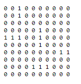
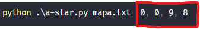
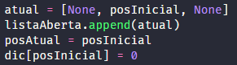
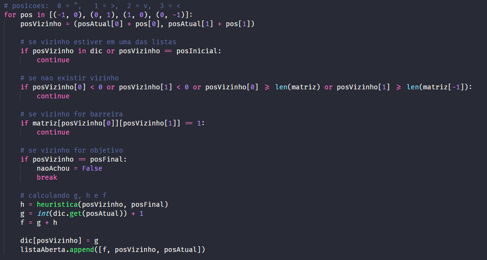
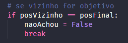
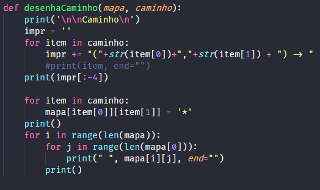
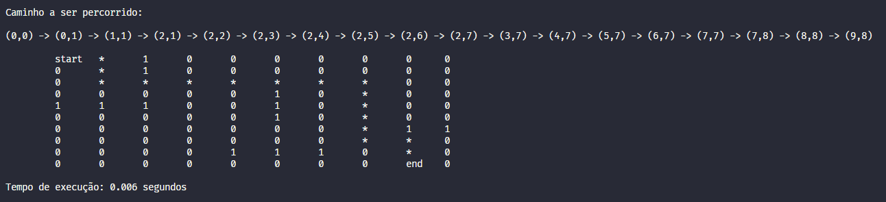

# Inteligência Artificial - Trabalho 01 2020/2 EAD
### Alunos: Eduarda Simões e Caicke Pinheiro<BR><BR>

## Como executar
O código foi desenvolvido em **Python** e para executá-lo, navegue até o diretório em que o arquivo `.py` se encontra e execute o arquivo, passando como parâmetro o arquivo com a matriz e as coordenadas separadas por espaço.

```
python3 a-star.py <arquivo_contendo_matriz> <coordenadas_separadas_por_espaco>
```

Como por exemplo:

```
python3 .\a-star.py mapa.txt 0 0 9 8
```
**Sendo:**<br>

<ul>
    <li><i>mapa.txt</i> = nome do arquivo contendo uma matriz;</li>
    e respectivamente:
    <li>0 = linha do ponto inicial;</li>
    <li>0 = coluna do ponto inicial;</li>
    <li>9 = linha do ponto final;</li>
    <li>8 = coluna do ponto final;</li>
</ul>
<BR>

## Explicação teórica

O **algoritmo A*** é bastante utilizado para encontrar o menor caminho entre dois pontos, com presença de obstáculos em coordenadas no meio do mapa.

<br>

<figure style="text-align:center">
	
    <figcaption>GIF retirado em <a href="tickstales.com">tickstales.com</a></figcaption>
</figure>

<br>

O  que torna o algoritmo tão eficiente é a presença de uma função f(n) que prevê o custo do próximo passo que será dado.  

<div style="text-align:center"><i>f(n) = g(n) + h(n)</i></div>

Onde:

<ul>
    <li><i>h(n)</i> é a heurística (estimativa) da distância entre o nó (ponto) corrente e o ponto final (objetivo);</li>
    <li><i>g(n)</i> é a custo para se mover da ponto inicial até o ponto corrente. Ou a soma das células percorridas até o ponto atual. </li>
</ul>
Para o cálculo da heurística, utilizamos a fórmula da distância de Manhattan:
<br>


<br>

Com isso, cada passo disponível, ou seja, ignorando os obstáculos, é avaliado e pulamos para o ponto vizinho de menor custo, em cada iteração.
<BR><BR>
## Problema proposto

No problema, é passado pela linha de comando uma matriz e as coordenadas iniciais e finais em que a paritir disso, temos que buscar o caminho correto do ponto de partida até o ponto final, desviando dos obstáculos presentes na matriz.





Os elementos na matriz com o valor 1 representam estes obstáculos que teremos que desviar durante o caminho. Já os elementos com o valor 0 estão livres para percorrermos.

Com os pontos iniciais e finais, temos que calcular o melhor caminho e mostrar na tela a lista das coordenadas que iremos percorrer.
<BR><BR>
## Implementação

Nosso algoritmo consiste em três partes, que se repetem: 

 <ul>
     <li>Tirar o nó corrente da lista aberta e colocar na lista fechada;</li>
     <li>Avaliar o custo de cada vizinho e escolher o mais eficiente;</li>
     <li> Conferir se alguma condição de parada foi satisfeita e desenhar o caminho.</li>
 </ul>

### Tirar o nó corrente da lista aberta e colocar na lista fechada

A lista aberta é inicializada apenas com o nó inicial. 



Além disso, inicializamos um dicionário, que guardará a posição de cada nó e seu custo (g) associado.

### Avaliar o custo de cada vizinho e escolher o mais eficiente

Com isso, avaliamos qual será o próximo vizinho que será visitado, calculando os custos (f, g e h) de cada uma deles e adicionando-os na lista aberta para a próxima iteração.



Considerando algumas condições para os vizinhos, como: se o nó adjacente é uma barreira, se ele realmente está localizado em uma faixa disponível no grid (mapa) do problema e se ele já está adicionado na lista aberta (caso já esteja, não é necessário calcular seu f(n) novamente.

### Conferir se alguma condição de parada foi satisfeita e desenhar o caminho

No meio da iteração de cada vizinho, percebemos que há uma condição que é verificada.



Caso o próximo passo escolhido for o ponto final, a iteração é encerrada e podemos ir para o próximo passo que é desenhar o caminho que foi percorrido pelo algoritmo.



Percorremos o caminho monitorando o pai de cada um dos nós que foi escolhido. Assim conseguimos obter a trajetória que foi traçada pelo algoritmo.
<BR><BR>
## Resultado

O algoritmo encerra a execução e conseguimos verificar o desenho e a lista que cada coordenada que devemos percorrer no melhor caminho entre os dois pontos escolhidos.

<figure style="text-align: center">
    
    <figcaption>Tempo medido usando a biblioteca <code>time</code> do Python.</figcaption>
</figure>

O algoritmo A* é bem eficiente, pois ele calcula apenas o custo dos nós adjacentes ao nó corrente, não sendo necessário percorrer todo o mapa para avaliar cada nó.
